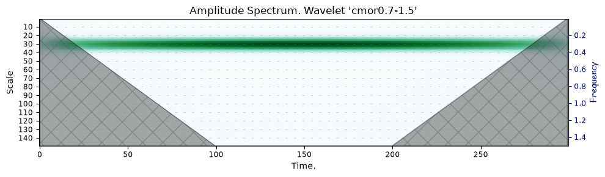
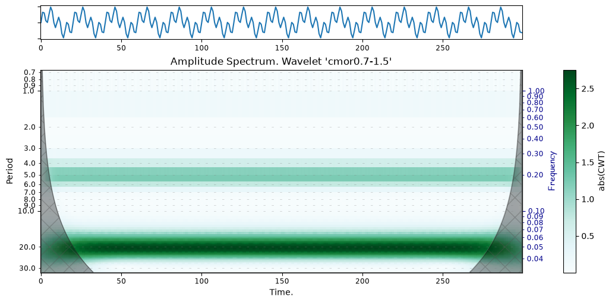

# scaleo

**[How-to](#how-to-use)** · **[Examples](#Real-world-data-examples)**

## Overview

**Scaleo** is a Python module for simplifying signal analysis operations using wavelet analysis.
It started as an attempt to create a tool for drawing _Scalogram_ (sometimes also called _Scaleogram_) after performing Continuous Wavelet Transform calculations..

The main requirements for creating the module were:

- storing all data and settings within a single, not around the code and constants,
- working with modern versions of Python,
- tools for primary filtering of signal noise using discrete wavelet transforms,
- flexible options for specifying a list of scales,
- built-in functions for primary analysis of Continuous Wavelet Transform (**CWT**) results,
- built-in functions for complex display of CWT computations,
- support for Cone Of Influence (**COI**)

**Scaleo** uses the [PyWavelets](https://pywavelets.readthedocs.io/en/latest/) library under the hood
to perform all the basic wavelet transform operations for signals.



> [!WARNING]
> This module is under active development. Methods and parameter names are subject to change or additions.


## How to use

### First steps

Getting started with the module is as simple as possible:
- import module,
- instantiate a class with your signal data and optional time ticks array,
- run the **CWT** transform,
- use results or call scalogram plotting function.

```python
fs = 1                   # Sampling frequency (Hz)
time_period = 300             # time period in sec
np.random.seed(42)
t = np.linspace(0, time_period, int(time_period * fs), endpoint=False)
p1 = 20; f1 = 1./p1;
clean_signal = np.sin(2*np.pi/p1*t) + np.sin(8*np.pi/p1*t)
cwt = CWT(clean_signal, fs, t, 'cmor0.7-1.5')
cwt.cwt(scales=np.arange(1, 50))
cwt.complex_plot(figsize=(10,5), cmap='BuGn', ticktype='period', twinticks='freq', logscale=True)

dominant_periods = [float(round(x,2)) for x in cwt.detect_power_peaks()]
print("-"*10, f"\nDetected dominant periods: {dominant_periods}")
```


**Output:**
```text
---------- 
Detected dominant periods: [5.33, 20.67]
```

### Real-world data examples

You can find examples of using the module on datasets describing real-world phenomena,
as well as a more detailed step-by-step guide.

- [Getting Started](doc/examples/Getting%20started.ipynb)
- [Sunspots data](doc/examples/Sunspots%20data.ipynb)
- [El Niño Dataset](doc/examples/El%20Nino.ipynb)
- [Bearing Faults](doc/examples/Bearing%20Faults.ipynb)

Additionally, the pros and cons of using signal cleaning methods through discrete wavelet analysis are considered:

[Signal denoising](doc/examples/Signal%20denoising.ipynb)


## Main methods

### CWT class

Initialize a new CWT instance. Method signature:

```python
__init__(signal_data: list | np.ndarray, sampling_freq:float,
         time_ticks: list | np.ndarray | None = None,
         wavelet_name: str = 'cmor1.5-1.0',
         xlabel: str | None = None):
```

**Arguments:**

| Name              | Type                                    | Description                                                                                                                           |
|:------------------|:----------------------------------------|:--------------------------------------------------------------------------------------------------------------------------------------|
| **signal_data**   | (list or np.ndarray):                   | The input signal values.                                                                                                              |
| **sampling_freq** | (float):                                | The sampling frequency of the signal.                                                                                                 |
| **time_ticks**    | (list or np.ndarray or None, optional): | The time ticks corresponding to the signal values. If `None` then will be initialized as array of values [0...1]. Defaults to `None`. |
| **wavelet_name**  | (str, optional):                        | The name of the wavelet to use. Defaults to 'cmor1.5-1.0'. See ```pywt.wavelist(kind='continuous')``` to get full list of wavelets.   |
| **xlabel**        | (str or None, optional):                | A custom text for x-axis (time-axis). Defaults to `None`.                                                                             |

### Computation of CWT

Just call ```cwt(..)``` method. You can pass on of the following parameters:

- array of desired scales,
- array of desired periods,
- tuple of (min,max) values of desired frequencies.

For example:

```python
cwt.cwt(periods=[1,5,7,8,9])
```

### Draw a Scalogram

To draw a scalogram use ```scalogram``` method of CWT class.

> [!NOTE]
> When called, the function correctly detects that calculations have not
> yet been performed and initiates them. However, the scale set will be
> selected automatically, which may not be optimal for your specific task. A
> good practice is to explicitly call the CWT calculation before any attempts
> to display the results.

Method signature:

```python
scalogram(ax=None, ticktype: str = 'period', spectrum: str = 'amp',
          cmap = 'PRGn', logscale: bool = False,
          figsize: tuple = (10,5), cbar: bool = True, cbar_ax = None,
          coi:bool = True, coi_alpha: float = .35,
          twinticks: str | None = None, ygrid: bool = True,
          vmin: float | None = None, vmax : float | None = None):
```

**Arguments:**

| Name          | Type                       | Description                                                                                                                                                                                                            |
|:--------------|:---------------------------|:-----------------------------------------------------------------------------------------------------------------------------------------------------------------------------------------------------------------------|
| **ax**        | (Any):                     | Matplotlib axes. If `None`, then own Matplotlib canvas will be created. Defaults `None`.                                                                                                                               |
| **ticktype**  | (str, optional):           | Type of Y-axes. One of the following predefined values: 'scale', 'period', 'freq'. Defaults 'period'.                                                                                                                  |
| **spectrum**  | (str, optional):           | Type of spectrum image. One of the following predefined values: 'amp' for amplitude, 'real' for use real part, 'imag' for use imaginary part of values, 'power' for spectrum based on power of signal. Defaults 'amp'. |
| **cmap**      | (Any, optional):           | Matplotlib colormap. Defaults 'PRGn'. See: https://matplotlib.org/stable/gallery/color/colormap_reference.html                                                                                                         |
| **logscale**  | (bool, optional):          | If `True` logarithmic scale will be used.                                                                                                                                                                              |
| **figsize**   | (tuple, optionale):        | Matplotlib 'figsize' parameter. Defaults `(10,5)`.                                                                                                                                                                     |
| **cbar**      | (bool, optionall):          | If `True` then cbar legend will be append. If 'twinticks' parameter is not `None` and 'cbar_ax' not provided, then this parameter is omitted. Defaults `True`.                                                         |
| **cbar_ax**   | (Any, optional):           | If provided, then legend will be drawed in this matplotlib context. Defaults `None`.                                                                                                                                   |
| **coi**       | (bool, optional):          | If `True`, then _Cone of Influence_ will be drawed above scalogram. Defaults `True`.                                                                                                                                   |
| **coi_alpha** | (float, optional):         | Opacity for COI. Defaults 0.35                                                                                                                                                                                         |
| **twinticks** | (str, optional):           | If not `None` second Y-axes to the right will be append. Values is predefined and same as for 'ticktype' parameter. Defaults `None`.                                                                                   |
| **ygrid**     | (bool, optional):          | If `True` then grid lines will be added to plot. Defaults `True`                                                                                                                                                       |
| **vmin**      | (float or None, optional): | If not `None`, then use this value as minimum for image color and colorbar. Defaults `None`.                                                                                                                           |
| **vmax**      | (float or None, optional): | If not `None`, then use this value as maximum for image color and colorbar. Defaults `None`.                                                                                                                           |


### Draw a complex plot

Method signature:

```python
complex_plot(title: str | None = None, figsize=(14,7),
             cmap: str = 'viridis', ticktype: str ='period',
             twinticks: str | None = None, spectrum: str = 'amp',
             coi: bool = True, coi_alpha: float = .35,
             logscale: bool = False, detect_peaks: bool = False):

```

**Arguments:**
Arguments is the same as for method ```scaleo(..)```. See [Draw a Scalogram](#Draw-a-scalogram).


### Rough detection of the found periods

The module attempts to analyze the calculation results and, using the signal
power values at different scales, to isolate periods.

To get a list of found periods, call the ```detect_power_peaks``` method.

If you need not only period value, but time window segments for each of periods,
then call method ```detect_power_peaks_bounds```
This method will return list of tuples where first element is a detected period value
and second element is array of tuples [start, end] time inside passed signal or empty array if it takes up the
entire time period.


## Installation

Sorry guys, but I didn't upload this module on PyPI repository. Maybe in the future if it gets enough users..

### Install with pip

To install using **pip**, run the following command:

```
pip install git+https://github.com/balarpan/scaleo.git
```

### Install with uv

If you are using **uv**, then the corresponding command will be:

```
uv add git+https://github.com/balarpan/scaleo.git
```

### Manual installation

Or you can simply get content of this repository and put it in the folder 'scaleo' inside your project folder.

### Prerequisites

This module depends on:

- **PyWavelet** >= 1.9.0
- **matplotlib** >= 3.11.1
- **numpy** >= 2.5.1, <3
- **scipy** >= 1.18.0


## Why scaleo

It's a python module, not a framework. You ```pip install``` it into your existing code and keep working with other familiar tools and solutions.
No need to repeatedly feeding same data to different instruments with same metadata (sample rate, wavelet central frequency, etc.).


## Contributing

Contributions and bug reports are welcome.
Please use pull request feature of GitHub to offer your code changes.
You can also create an issue to discuss the discovered features of the module.

## Authors

* **Denis Savitskiy** 


## Acknowledgments

* The [PyWavelets](https://pywavelets.readthedocs.io/en/latest/) project, its
    team and all contributors. The project is entirely based on this excellent
    library and the functions it implements.
* The [PyCWT](https://pycwt.readthedocs.io/en/development/) project for
    inspiration from the visual possibilities of visualization.
* The [Scaleogram](https://github.com/alsauve/scaleogram) project by Alexandre Sauve, which back
    in 2019 gave us the opportunity to comfortably work with CWT

---

*© 2026 Denis Savitskiy. All rights reserved.*
